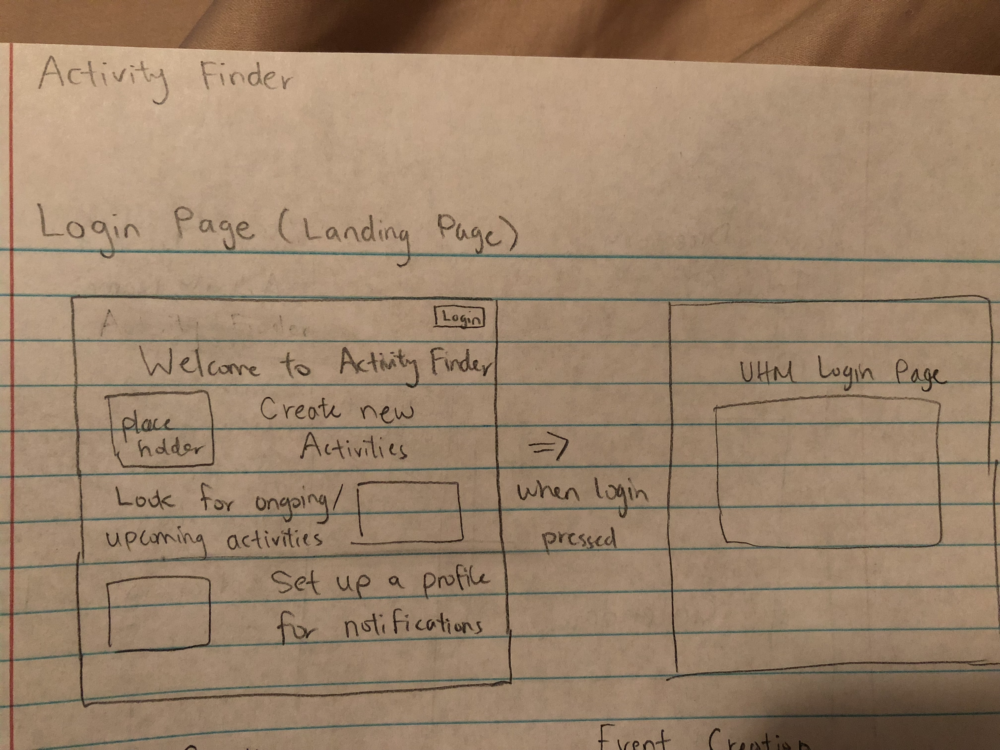
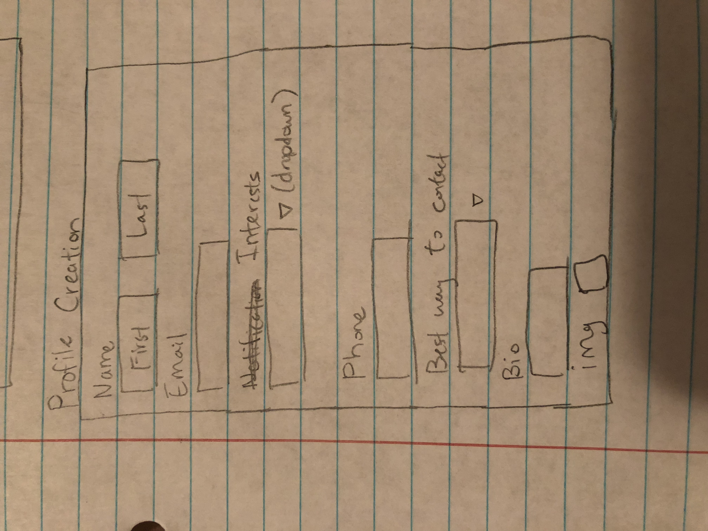
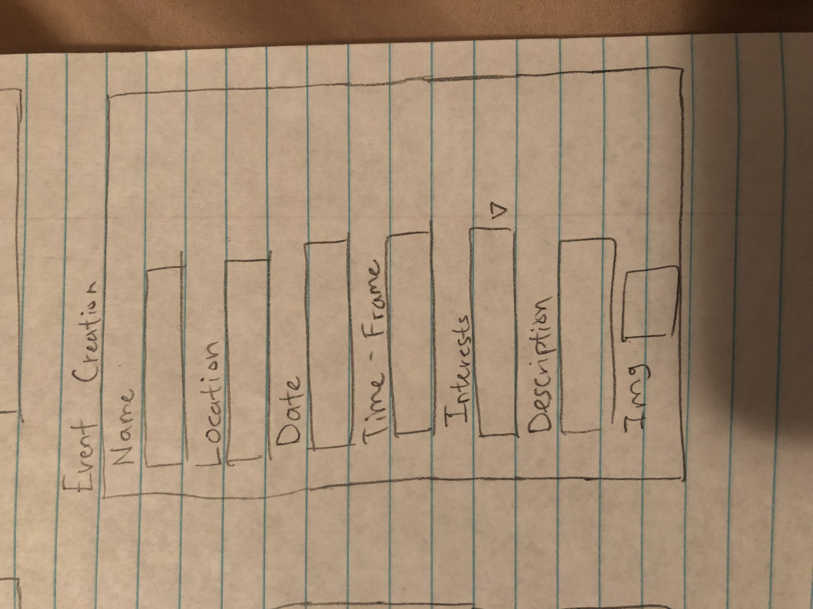
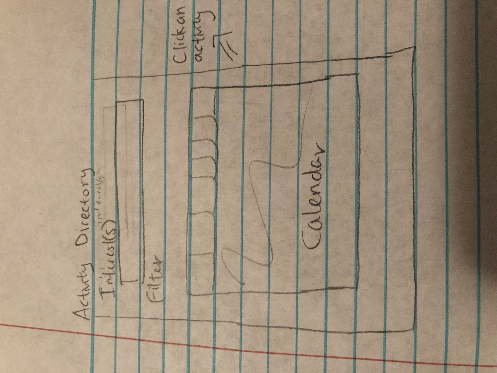
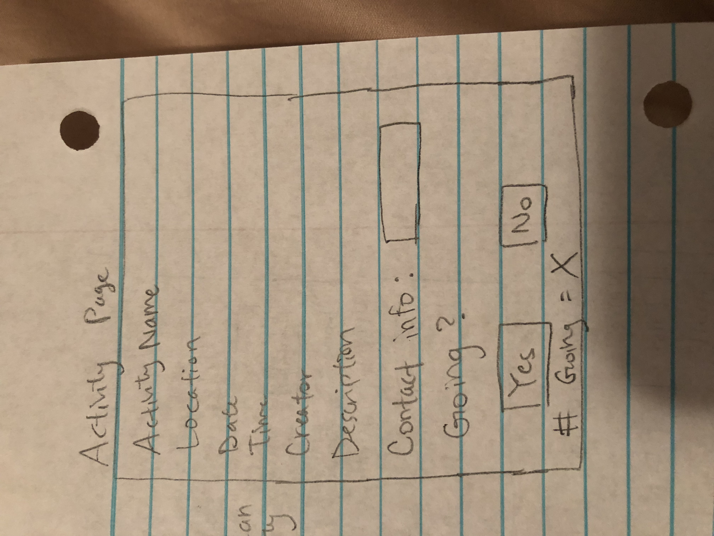

# Table of Contents

* [About Activity Finder](#about-activityfinder)
* [Installation](#installation)
* [Deployment](#deployment)
* [Development history](#development-history)
  * [Milestone 1: Mockup development](#milestone-1-mockup-development)
  * [Milestone 2: Data model development](#milestone-2-data-model-development)
  
# About Activity Finder
Activity Finder is a meteor application allowing UH students to find activities and events to do with others on the island. Students will be able to set notifications when a new event or activity is posted. Students can filter activites based upon their interests or location. Students will also be able to view future events or activites on a calendar.

## Project Mockup
The following is the first rough draft of our overall project layout and structure. There are some changes and additions that might be possible in the future. This is only the starting point for the project.

### Login Page


### Profile Creation


### Event Creation


### Activity Directory


### Activity Info


# Installation

First, [install Meteor](https://www.meteor.com/install).

Second, [download a copy of BowFolios](https://github.com/bowfolios/bowfolios/archive/master.zip), or clone it using git.
  
Third, cd into the app/ directory and install libraries with:

```
$ meteor npm install
```

Fourth, run the system with:

```
$ meteor npm run start
```

If all goes well, the application will appear at [http://localhost:3000](http://localhost:3000). If you have an account on the UH test CAS server, you can login.

# Deployment

# Development History

## Milestone 1: Mockup development
Milestone 1 was implemented as a [Github project M1](https://github.com/activityfinder/activityfinder/projects/1)
## Milestone 2: Data model development 
