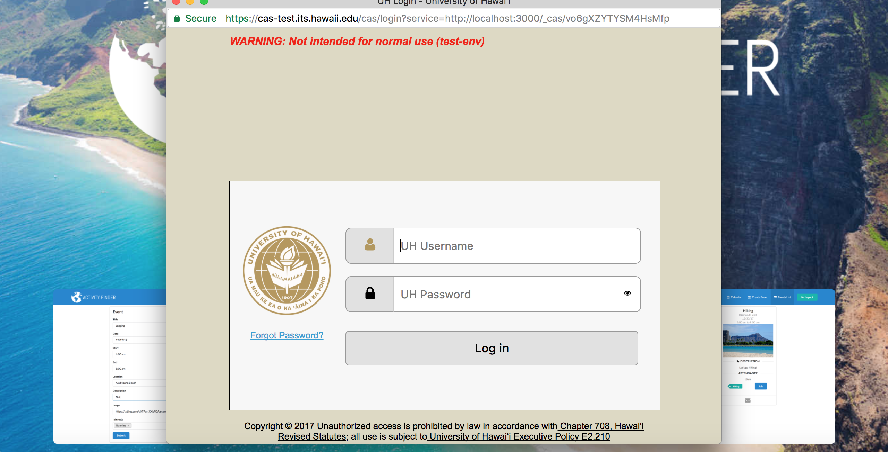
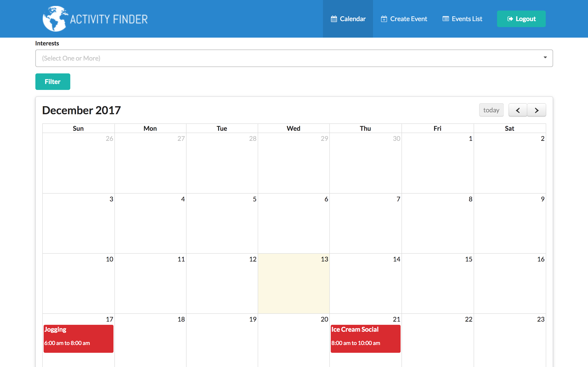
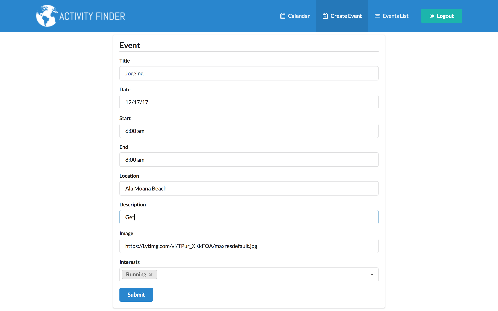
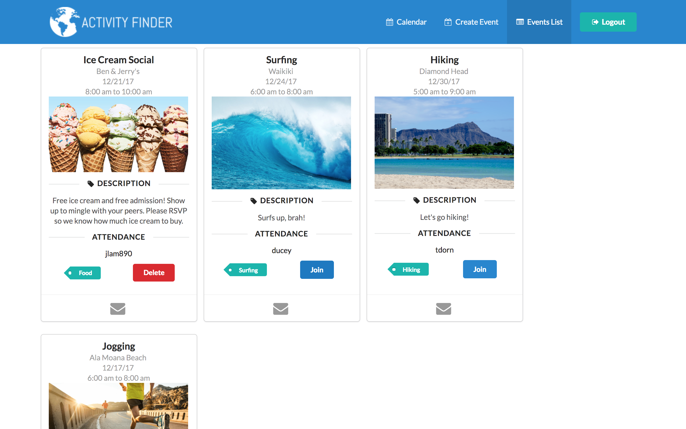
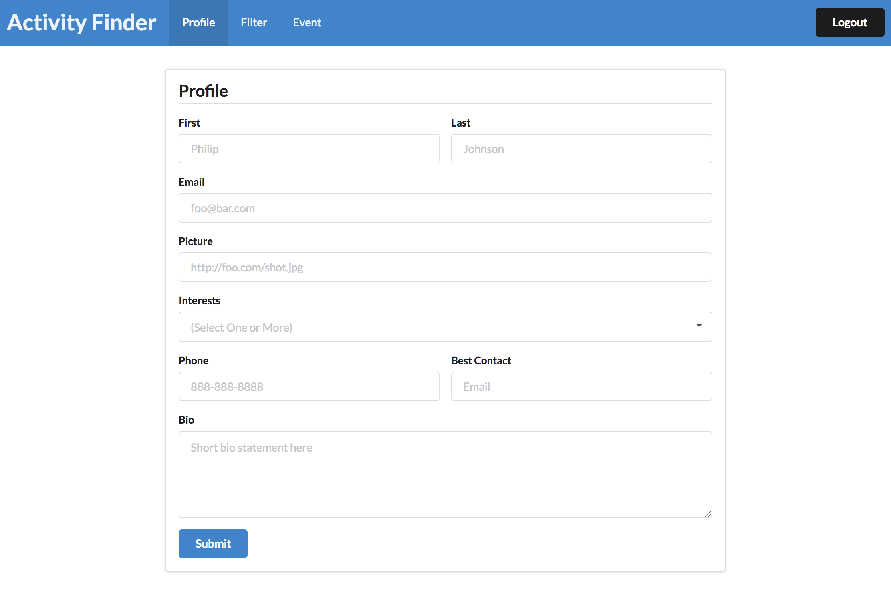
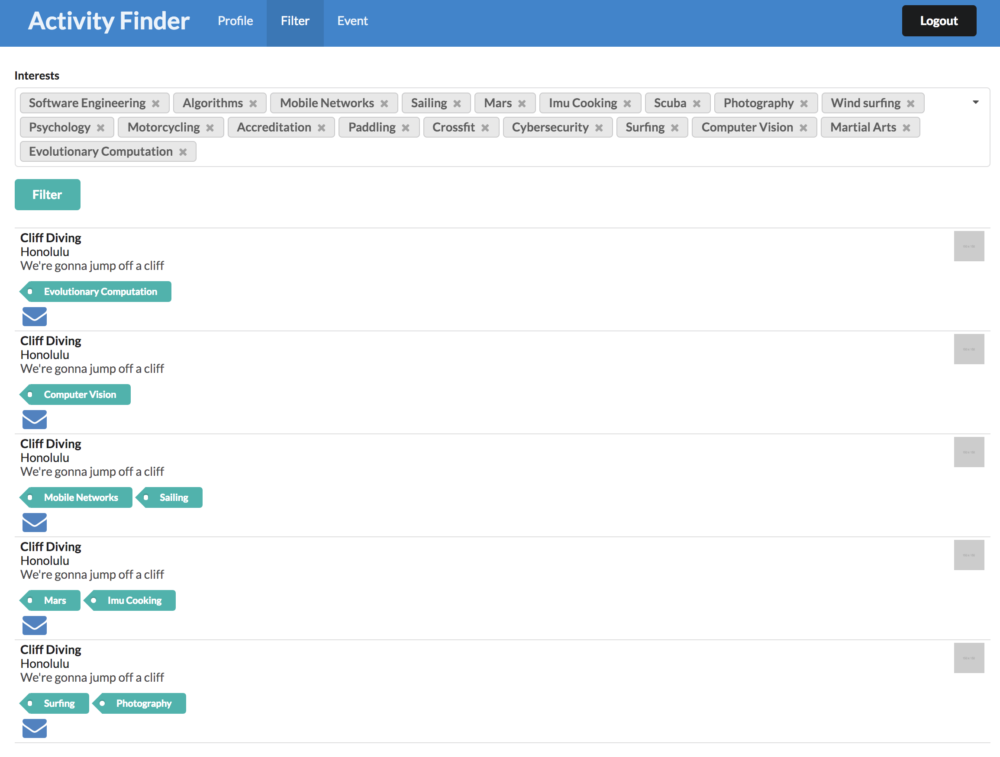
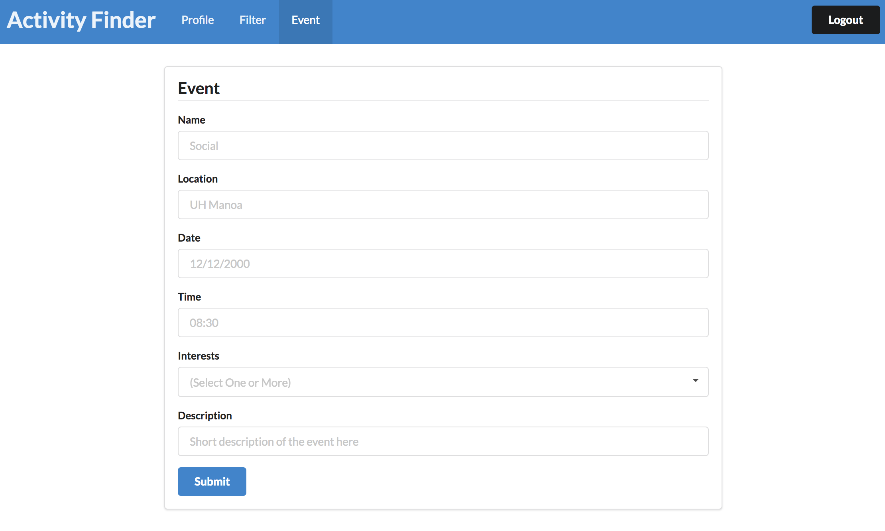
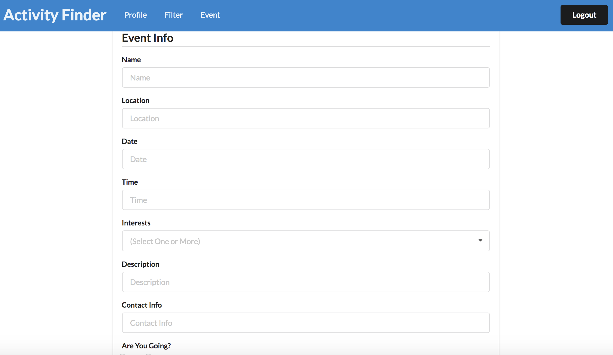

# Table of contents

* [About Activity Finder](#about-activityfinder)
* [Installation](#installation)
* [Application Design](#application-design)
* [Deployment](#deployment)
* [Development History](#development-history)
  * [Milestone 1: Mockup development](#milestone-1-mockup-development)
  * [Milestone 2: Data model development](#milestone-2-data-model-development)
* [Community Feedback](#community-feedback)
* [Contact Us](#contact-us)
  
# About Activity Finder

Activity Finder is a meteor application allowing UH students to find activities to do with others on the island.

## User Guide

### [Landing Page](http://activityfinder.meteorapp.com/)


UH students may login to Activity Finder by clicking on the login button. The UH CAS authentication screen then appears and requests your UH account and password:



### [Calendar](http://activityfinder.meteorapp.com/ducey/calendar)



Students will be greeted with the calendar page after logging in. The calendar displays all events currently in the system. Red events are the ones that the current user is attending and blue events are other available events that the user can join.

### [Create Event](http://activityfinder.meteorapp.com/ducey/event)



Here users can create an event that will be displayed on the calendar and event list page.

### [Event List](http://activityfinder.meteorapp.com/ducey/event-list)



Activity Finder also provides an event list page, where you can find out more about specific events. Also, students may join a specific event by clicking on the join button. They may also leave the event by clicking the leave button. Users can also send an email to the owner of the event to get more information. Lastly, users can delete their own events if they wish.

# Installation

First, [install Meteor](https://www.meteor.com/install).

Second, [download a copy of Activity Finder](https://github.com/activityfinder/activityfinder/archive/master.zip), or clone it using git.
  
Third, cd into the app/ directory and install libraries with:

```
$ meteor npm install
```

Fourth, run the system with:

```
$ meteor npm run start
```

If all goes well, the application will appear at [http://localhost:3000](http://localhost:3000). If you have an account on the UH test CAS server, you can login.

# Application Design

## Directory Structure

The top-level directory structure contains:

```
app/        # holds the Meteor application sources
config/     # holds configuration files, such as settings.development.json
.gitignore  # don't commit IntelliJ project files, node_modules, and settings.production.json
```

This structure separates configuration files (such as the settings files) in the config/ directory from the actual Meteor application in the app/ directory.

The app/ directory has this top-level structure:

```
client/
  lib/           # holds Semantic UI files.
  head.html      # the <head>
  main.js        # import all the client-side html and js files. 

imports/
  api/           # Define collection processing code (client + server side)
    base/
    event/
    interest/
  startup/       # Define code to run when system starts up (client-only, server-only)
    client/        
    server/        
  ui/
    components/  # templates that appear inside a page template.
    layouts/     # Layouts contain common elements to all pages (i.e. menubar and footer)
    pages/       # Pages are navigated to by FlowRouter routes.
    stylesheets/ # CSS customizations, if any.

node_modules/    # managed by Meteor

private/
  database/      # holds the JSON file used to initialize the database on startup.

public/          
  images/        # holds static images for landing page and predefined sample users.
  
server/
   main.js       # import all the server-side js files.
```
## Import Conventions

This system adheres to the Meteor 1.4 guideline of putting all application code in the imports/ directory, and using client/main.js and server/main.js to import the code appropriate for the client and server in an appropriate order.

For example, here is the contents of client/main.js:

```
import '/imports/startup/client';
import '/imports/ui/components/form-controls';
import '/imports/ui/components/landing';
import '/imports/ui/components/event-list';
import '/imports/ui/layouts/landing';
import '/imports/ui/layouts/shared';
import '/imports/ui/layouts/user';
import '/imports/ui/layouts/event-list';
import '/imports/ui/pages/calendar';
import '/imports/ui/pages/landing';
import '/imports/ui/pages/event-create';
import '/imports/ui/pages/event-list';
import '/imports/ui/stylesheets/style.css';
import '/imports/api/base';
import '/imports/api/interest';
import '/imports/api/event';
```

Apart from the last line that imports style.css directly, the other lines all invoke the index.js file in the specified directory.

## Naming conventions

This system adopts the following naming conventions:

  * Files and directories are named in all lowercase, with words separated by hyphens. Example: accounts-config.js
  * "Global" Javascript variables (such as collections) are capitalized. Example: Events.
  * Other Javascript variables are camel-case. Example: collectionList.
  * Templates representing pages are capitalized, with words separated by underscores. Example: Calendar_Page. The files for this template are lower case, with hyphens rather than underscore. Example: calendar-page.html, calendar-page.js.
  * Routes to pages are named the same as their corresponding page. Example: Calendar_Page.
  
## CSS

The application uses the [Semantic UI](http://semantic-ui.com/) CSS framework. To learn more about the Semantic UI theme integration with Meteor, see [Semantic-UI-Meteor](https://github.com/Semantic-Org/Semantic-UI-Meteor).

The Semantic UI theme files are located in [app/client/lib/semantic-ui](https://github.com/ics-software-engineering/meteor-application-template/tree/master/app/client/lib/semantic-ui) directory. Because they are located in the client/ directory and not the imports/ directory, they do not need to be explicitly imported to be loaded. (Meteor automatically loads all files into the client that are located in the client/ directory).

## Routing

For display and navigation among its four pages, the application uses [Flow Router](https://github.com/kadirahq/flow-router).

Routing is defined in [imports/startup/client/router.js](https://github.com/ics-software-engineering/meteor-application-template/blob/master/app/imports/startup/client/router.js).

## Authentication

For authentication, the application uses the University of Hawaii CAS test server, and follows the approach shown in [meteor-example-uh-cas](http://ics-software-engineering.github.io/meteor-example-uh-cas/).

When the application is run, the CAS configuration information must be present in a configuration file such as  [config/settings.development.json](https://github.com/ics-software-engineering/meteor-application-template/blob/master/config/settings.development.json).

## Configuration

The [config](https://github.com/activityfinder/activityfinder/tree/master/config) directory is intended to hold settings files.  The repository contains one file: [config/settings.development.json](https://github.com/activityfinder/activityfinder/blob/master/config/settings.development.json).

The [.gitignore](https://github.com/activityfinder/activityfinder/blob/master/.gitignore) file prevents a file named settings.production.json from being committed to the repository. So, if you are deploying the application, you can put settings in a file named settings.production.json and it will not be committed.

# Deployment

[Here is a running deployment of our system on Galaxy](http://activityfinder.meteorapp.com/).

# Development History

## Milestone 1: Mockup development

Milestone 1 started on November 7th, 2017 and ended on November 22nd, 2017.

The goal for Milestone 1 was to provide a mockup of atleast four pages of the application, use Github issues and a Github project to manage the development of this release of the system and to adhere to Issue Driven Project Management practices.

Milestone 1 consisted of 6 issues and was managed via [Github project M1](https://github.com/activityfinder/activityfinder/projects/1).







## Milestone 2: Data model development

Milestone 2 started on November 23rd, 2017 and ended on December 13th, 2017.

The goal for Milestone 2 was to significantly improve the functionality and quality of your application beyond Milestone 1. We were also tasked to find at least five UH community members to to try out our system and provide feedback.

Milestone 1 consisted of 7 issues and was managed via [Github project M2](https://github.com/activityfinder/activityfinder/projects/2).

# Community Feedback

## Responses from a group of five UH EE students:

*"The landing page is very good, it's very inviting and makes me want to use the app."*

*"I think it looks user-friendly."*

*"Good colors."*

*"One feature I thought was missing was being taken to the events list page after clicking on an event from the calendar. Other than that, I think the app looks nice."*

*"I guess I would rather have the names private on the events list page. I wouldn't want people to see which activities I was signed up for."*


# Contact Us

* Joshua Ducey - ducey@hawaii.edu
* Tyler Dorn - tdorn@hawaii.edu
* Joshua Lam - jlam890@hawaii.edu
